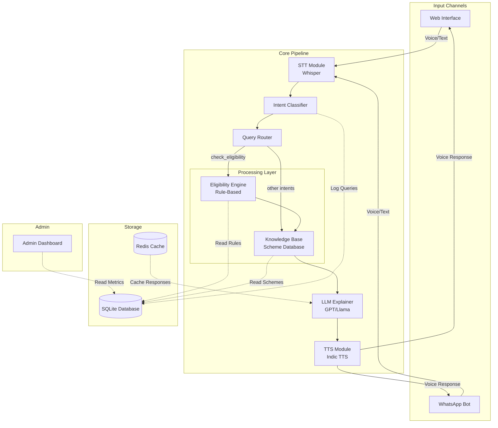
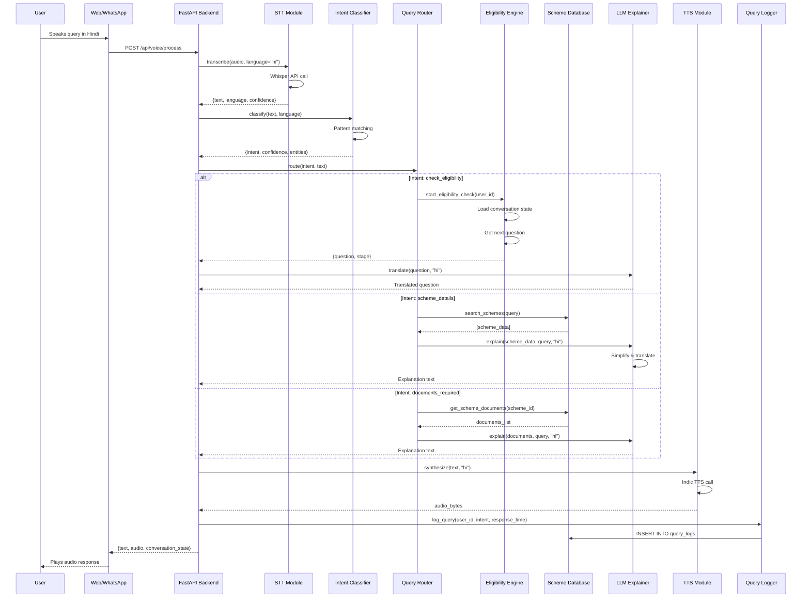
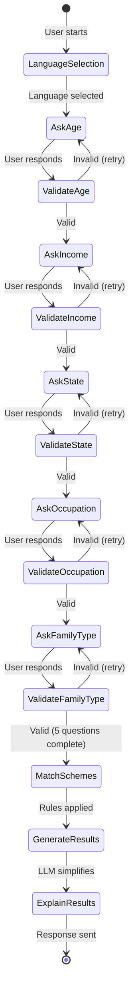
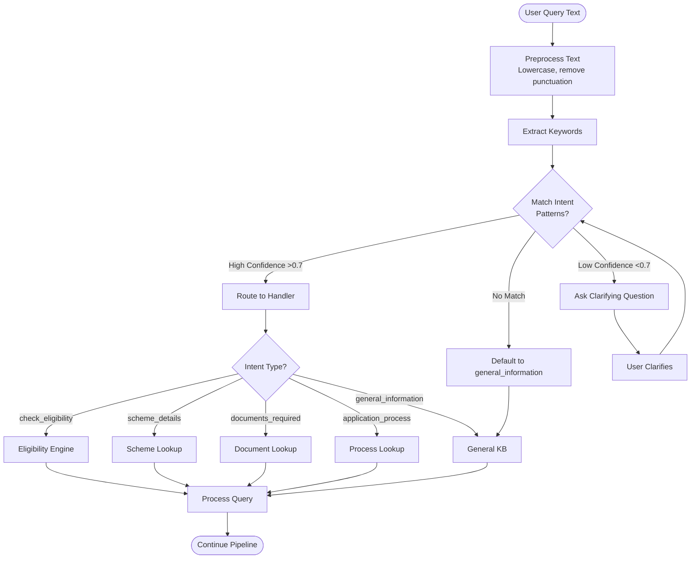
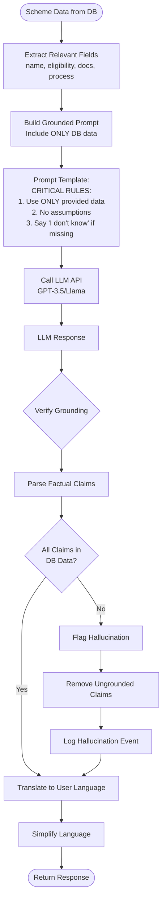
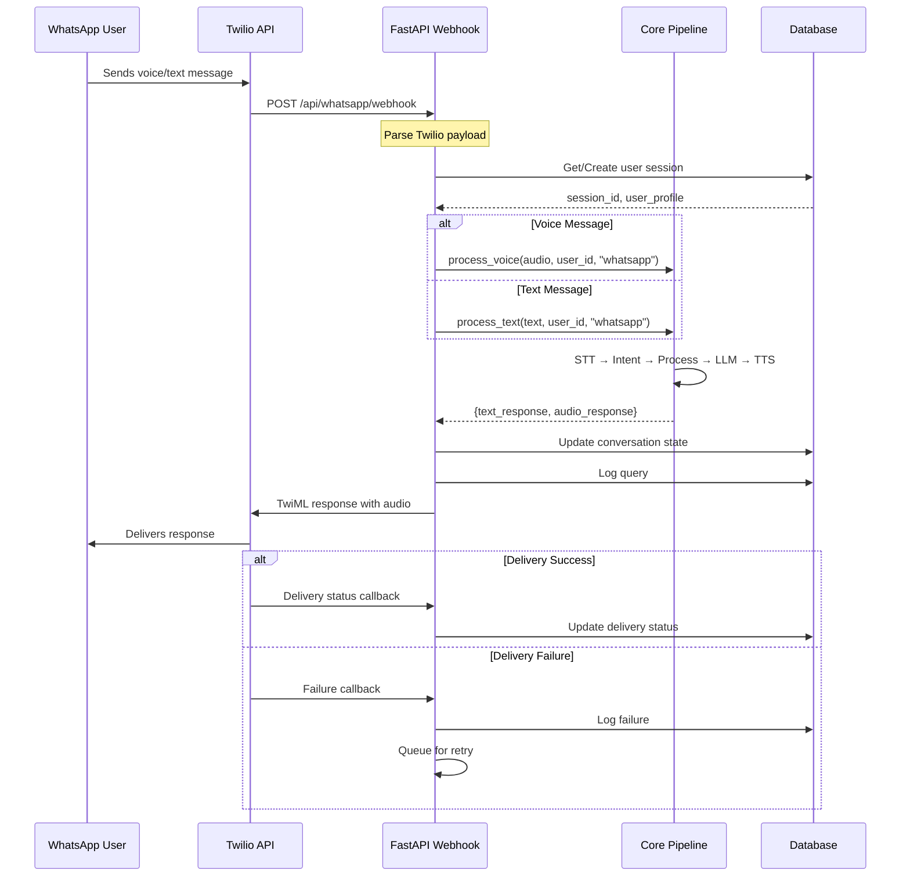
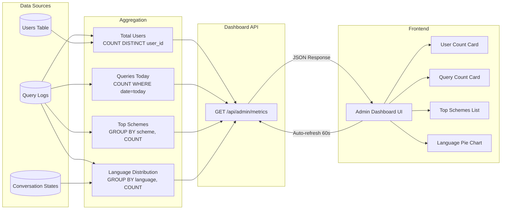
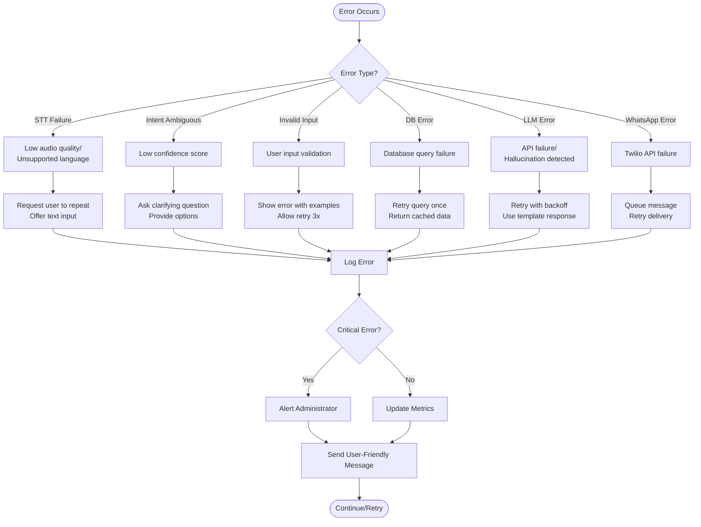

# Design Document: BharatAccess AI Assistant

## Overview

BharatAccess AI Assistant is a voice-first, multi-language system that helps underserved citizens access government schemes. The architecture follows a strict pipeline: Voice → STT → Intent Detection → Eligibility Engine/Knowledge Base → LLM Explanation → TTS → Response. The design emphasizes modularity, low-bandwidth optimization, and factual accuracy through database grounding.

The system is built with Python and FastAPI, using Whisper for STT, GPT/Llama for explanation, and Indic TTS for voice output. The eligibility engine is purely rule-based to ensure deterministic and auditable results. The LLM is constrained to only simplify and translate information from the database, never to generate scheme information independently.

## Architecture

### High-Level Architecture



### Detailed Flow Diagrams

#### Complete User Interaction Flow



#### Eligibility Check Flow (Multi-Turn)



#### Intent Classification Flow



#### LLM Grounding Flow (Critical)



#### WhatsApp Integration Flow



#### Admin Dashboard Data Flow



#### Error Handling Flow



### Module Responsibilities

**STT Module (Speech-to-Text)**
- Accepts audio input from web and WhatsApp channels
- Uses OpenAI Whisper for transcription
- Supports Hindi and one regional language (Telugu/Tamil)
- Returns transcribed text with language detection

**Intent Classifier**
- Analyzes transcribed text to determine user intent
- Classifies into: check_eligibility, scheme_details, documents_required, application_process, general_information
- Uses keyword matching and simple NLP patterns (no heavy ML)
- Returns intent type and confidence score

**Query Router**
- Routes queries to appropriate handler based on intent
- Manages conversation state for multi-turn interactions
- Handles fallback to clarifying questions when intent is ambiguous

**Eligibility Engine**
- Implements rule-based eligibility determination
- Asks 5 structured questions: age, income, state, occupation, family_type
- Matches user responses against scheme eligibility rules
- Returns categorized results: eligible, possibly_eligible, not_eligible with reasons
- Does NOT use LLM for decision-making

**Knowledge Base / Scheme Database**
- Stores verified government scheme information
- Provides query interface for scheme lookup
- Returns structured scheme data for LLM processing

**LLM Explainer**
- Simplifies technical language into user-friendly explanations
- Translates responses to user's selected language
- Grounds all responses in database results (no hallucination)
- Uses prompt engineering to constrain output to database facts

**TTS Module (Text-to-Speech)**
- Converts text responses to natural speech
- Uses Indic TTS for Hindi and regional languages
- Optimizes audio compression for low-bandwidth scenarios

**WhatsApp Bot**
- Integrates with Twilio WhatsApp API
- Handles voice and text messages
- Manages conversation state per user
- Sends responses via WhatsApp

**Admin Dashboard**
- Displays usage metrics: total users, queries today, top schemes, language distribution
- Provides real-time monitoring
- Simple HTML/CSS/JS interface

## Components and Interfaces

### API Endpoints (FastAPI)

```python
# Voice Input Endpoint
POST /api/voice/process
Request:
{
    "audio": "base64_encoded_audio",
    "language": "hi" | "te" | "ta",
    "channel": "web" | "whatsapp",
    "user_id": "string",
    "session_id": "string"
}
Response:
{
    "transcription": "string",
    "intent": "string",
    "response_text": "string",
    "response_audio": "base64_encoded_audio",
    "conversation_state": "object"
}

# Text Input Endpoint
POST /api/text/process
Request:
{
    "text": "string",
    "language": "hi" | "te" | "ta",
    "channel": "web" | "whatsapp",
    "user_id": "string",
    "session_id": "string"
}
Response:
{
    "intent": "string",
    "response_text": "string",
    "response_audio": "base64_encoded_audio",
    "conversation_state": "object"
}

# WhatsApp Webhook
POST /api/whatsapp/webhook
Request: Twilio webhook format
Response: TwiML response

# Admin Dashboard Data
GET /api/admin/metrics
Response:
{
    "total_users": "integer",
    "queries_today": "integer",
    "top_schemes": ["array of scheme names"],
    "language_distribution": {"hi": 100, "te": 50}
}

# Language Selection
POST /api/user/language
Request:
{
    "user_id": "string",
    "language": "hi" | "te" | "ta"
}
Response:
{
    "success": "boolean"
}
```

### STT Module Interface

```python
class STTModule:
    def transcribe(self, audio_bytes: bytes, language: str) -> dict:
        """
        Transcribes audio to text using Whisper.
        
        Args:
            audio_bytes: Raw audio data
            language: Target language code (hi, te, ta)
            
        Returns:
            {
                "text": "transcribed text",
                "language": "detected language",
                "confidence": 0.95
            }
        """
        pass
    
    def detect_language(self, audio_bytes: bytes) -> str:
        """Detects language from audio."""
        pass
```

### Intent Classifier Interface

```python
class IntentClassifier:
    INTENTS = [
        "check_eligibility",
        "scheme_details",
        "documents_required",
        "application_process",
        "general_information"
    ]
    
    def classify(self, text: str, language: str) -> dict:
        """
        Classifies user intent from text.
        
        Args:
            text: Transcribed user query
            language: Language code
            
        Returns:
            {
                "intent": "check_eligibility",
                "confidence": 0.92,
                "entities": {"scheme_name": "PM-KISAN"}
            }
        """
        pass
    
    def extract_entities(self, text: str, intent: str) -> dict:
        """Extracts relevant entities based on intent."""
        pass
```

### Eligibility Engine Interface

```python
class EligibilityEngine:
    QUESTIONS = [
        {"id": "age", "text": "What is your age?", "type": "integer", "validation": "range(0, 120)"},
        {"id": "income", "text": "What is your annual household income?", "type": "integer"},
        {"id": "state", "text": "Which state do you live in?", "type": "string"},
        {"id": "occupation", "text": "What is your occupation?", "type": "string"},
        {"id": "family_type", "text": "What is your family type?", "type": "enum", "options": ["nuclear", "joint", "single"]}
    ]
    
    def get_next_question(self, conversation_state: dict) -> dict:
        """Returns next eligibility question."""
        pass
    
    def validate_response(self, question_id: str, response: str) -> dict:
        """Validates user response to eligibility question."""
        pass
    
    def determine_eligibility(self, user_profile: dict) -> list:
        """
        Determines scheme eligibility based on user profile.
        
        Args:
            user_profile: {
                "age": 35,
                "income": 200000,
                "state": "Maharashtra",
                "occupation": "farmer",
                "family_type": "nuclear"
            }
            
        Returns:
            [
                {
                    "scheme_id": "PM-KISAN",
                    "scheme_name": "PM-KISAN",
                    "status": "eligible",
                    "reason": "Meets age and occupation criteria",
                    "match_score": 1.0
                },
                {
                    "scheme_id": "PMAY",
                    "scheme_name": "Pradhan Mantri Awas Yojana",
                    "status": "possibly_eligible",
                    "reason": "Income within range, verify land ownership",
                    "match_score": 0.7
                }
            ]
        """
        pass
```

### Scheme Database Interface

```python
class SchemeDatabase:
    def get_scheme_by_id(self, scheme_id: str) -> dict:
        """Retrieves scheme details by ID."""
        pass
    
    def search_schemes(self, query: str, language: str) -> list:
        """Searches schemes by name or keywords."""
        pass
    
    def get_all_schemes(self) -> list:
        """Returns all schemes in database."""
        pass
    
    def add_scheme(self, scheme_data: dict) -> bool:
        """Adds new scheme to database."""
        pass
```

### LLM Explainer Interface

```python
class LLMExplainer:
    def explain(self, scheme_data: dict, user_query: str, language: str) -> str:
        """
        Generates user-friendly explanation grounded in scheme data.
        
        Args:
            scheme_data: Structured scheme information from database
            user_query: Original user question
            language: Target language for response
            
        Returns:
            Simplified, translated explanation
        """
        pass
    
    def translate(self, text: str, target_language: str) -> str:
        """Translates text to target language."""
        pass
    
    def simplify(self, text: str, language: str) -> str:
        """Simplifies technical language."""
        pass
```

### TTS Module Interface

```python
class TTSModule:
    def synthesize(self, text: str, language: str) -> bytes:
        """
        Converts text to speech audio.
        
        Args:
            text: Text to convert
            language: Target language code
            
        Returns:
            Audio bytes (compressed for low bandwidth)
        """
        pass
    
    def get_supported_languages(self) -> list:
        """Returns list of supported language codes."""
        pass
```

## Data Models

### Scheme Data Model

```python
{
    "scheme_id": "PM-KISAN",
    "scheme_name": "Pradhan Mantri Kisan Samman Nidhi",
    "description": "Income support to farmers",
    "eligibility_rules": {
        "age": {"min": 18, "max": null},
        "occupation": ["farmer", "agricultural_worker"],
        "income": {"max": null},
        "state": ["all"],
        "land_ownership": {"required": true, "max_hectares": 2}
    },
    "documents_required": [
        "Aadhaar card",
        "Bank account details",
        "Land ownership documents"
    ],
    "application_process": [
        "Visit PM-KISAN portal",
        "Register with Aadhaar",
        "Fill application form",
        "Upload documents",
        "Submit for verification"
    ],
    "official_link": "https://pmkisan.gov.in",
    "benefit_amount": "₹6000 per year",
    "benefit_frequency": "Three installments of ₹2000",
    "language_content": {
        "hi": {
            "scheme_name": "प्रधानमंत्री किसान सम्मान निधि",
            "description": "किसानों को आय सहायता"
        },
        "te": {
            "scheme_name": "ప్రధాన మంత్రి కిసాన్ సమ్మాన్ నిధి",
            "description": "రైతులకు ఆదాయ మద్దతు"
        }
    }
}
```

### User Profile Model

```python
{
    "user_id": "uuid",
    "phone_number": "string",
    "preferred_language": "hi",
    "profile": {
        "age": 35,
        "income": 200000,
        "state": "Maharashtra",
        "occupation": "farmer",
        "family_type": "nuclear"
    },
    "created_at": "timestamp",
    "last_interaction": "timestamp"
}
```

### Conversation State Model

```python
{
    "session_id": "uuid",
    "user_id": "uuid",
    "channel": "web" | "whatsapp",
    "language": "hi",
    "current_intent": "check_eligibility",
    "conversation_stage": "collecting_profile",
    "collected_data": {
        "age": 35,
        "income": 200000
    },
    "pending_questions": ["state", "occupation", "family_type"],
    "last_message": "What is your age?",
    "created_at": "timestamp",
    "updated_at": "timestamp"
}
```

### Query Log Model

```python
{
    "query_id": "uuid",
    "user_id": "uuid",
    "session_id": "uuid",
    "timestamp": "timestamp",
    "channel": "web" | "whatsapp",
    "language": "hi",
    "input_type": "voice" | "text",
    "transcription": "string",
    "intent": "check_eligibility",
    "response": "string",
    "response_time_ms": 2500,
    "schemes_returned": ["PM-KISAN", "PMAY"]
}
```

### Database Schema (SQLite)

```sql
-- Schemes table
CREATE TABLE schemes (
    scheme_id TEXT PRIMARY KEY,
    scheme_name TEXT NOT NULL,
    description TEXT,
    eligibility_rules TEXT, -- JSON
    documents_required TEXT, -- JSON array
    application_process TEXT, -- JSON array
    official_link TEXT,
    benefit_amount TEXT,
    benefit_frequency TEXT,
    language_content TEXT, -- JSON
    created_at TIMESTAMP DEFAULT CURRENT_TIMESTAMP,
    updated_at TIMESTAMP DEFAULT CURRENT_TIMESTAMP
);

-- Users table
CREATE TABLE users (
    user_id TEXT PRIMARY KEY,
    phone_number TEXT UNIQUE,
    preferred_language TEXT DEFAULT 'hi',
    profile TEXT, -- JSON
    created_at TIMESTAMP DEFAULT CURRENT_TIMESTAMP,
    last_interaction TIMESTAMP
);

-- Conversation states table
CREATE TABLE conversation_states (
    session_id TEXT PRIMARY KEY,
    user_id TEXT,
    channel TEXT,
    language TEXT,
    current_intent TEXT,
    conversation_stage TEXT,
    collected_data TEXT, -- JSON
    pending_questions TEXT, -- JSON array
    last_message TEXT,
    created_at TIMESTAMP DEFAULT CURRENT_TIMESTAMP,
    updated_at TIMESTAMP DEFAULT CURRENT_TIMESTAMP,
    FOREIGN KEY (user_id) REFERENCES users(user_id)
);

-- Query logs table
CREATE TABLE query_logs (
    query_id TEXT PRIMARY KEY,
    user_id TEXT,
    session_id TEXT,
    timestamp TIMESTAMP DEFAULT CURRENT_TIMESTAMP,
    channel TEXT,
    language TEXT,
    input_type TEXT,
    transcription TEXT,
    intent TEXT,
    response TEXT,
    response_time_ms INTEGER,
    schemes_returned TEXT, -- JSON array
    FOREIGN KEY (user_id) REFERENCES users(user_id)
);

-- Metrics table (for dashboard)
CREATE TABLE metrics (
    metric_id INTEGER PRIMARY KEY AUTOINCREMENT,
    metric_date DATE,
    total_users INTEGER,
    queries_count INTEGER,
    language_distribution TEXT, -- JSON
    top_schemes TEXT, -- JSON array
    created_at TIMESTAMP DEFAULT CURRENT_TIMESTAMP
);
```

## Correctness Properties

*A property is a characteristic or behavior that should hold true across all valid executions of a system—essentially, a formal statement about what the system should do. Properties serve as the bridge between human-readable specifications and machine-verifiable correctness guarantees.*


### Property 1: Intent Classification Completeness
*For any* transcribed user query, the Intent_Classifier should categorize it into exactly one of the five defined intent types (check_eligibility, scheme_details, documents_required, application_process, general_information).
**Validates: Requirements 2.1**

### Property 2: Eligibility Question Completeness
*For any* eligibility check flow, the Eligibility_Engine should ask exactly 5 structured questions (age, income, state, occupation, family_type) before performing eligibility matching.
**Validates: Requirements 3.1**

### Property 3: Eligibility Matching Execution
*For any* complete user profile with all 5 eligibility questions answered, the Eligibility_Engine should perform matching against all schemes in the database and return results.
**Validates: Requirements 3.2**

### Property 4: Eligibility Result Structure
*For any* eligibility matching result, each scheme should be categorized as exactly one of (eligible, possibly_eligible, not_eligible) and include a specific reason for the categorization.
**Validates: Requirements 3.3**

### Property 5: Invalid Input Handling
*For any* invalid response to an eligibility question (e.g., negative age, non-numeric income), the System should reject the input and request a valid response with examples.
**Validates: Requirements 3.5**

### Property 6: Scheme Data Completeness
*For any* scheme stored in the Scheme_Database, it should contain all required fields: scheme_name, eligibility_rules, documents_required, application_process, and official_link.
**Validates: Requirements 4.2**

### Property 7: Language-Specific Response Generation
*For any* user with a selected language other than English, all LLM_Explainer responses should be generated in the user's selected language.
**Validates: Requirements 5.2**

### Property 8: LLM Response Grounding (Critical)
*For any* response generated by the LLM_Explainer, all factual claims (scheme names, eligibility criteria, document requirements, application processes, benefit amounts) should be directly traceable to data present in the Scheme_Database, with no invented or hallucinated information.
**Validates: Requirements 5.3, 5.4, 5.5, 14.1, 14.2, 14.4**

### Property 9: Session Language Consistency
*For any* conversation session, once a user selects a language, all subsequent system responses in that session should maintain the same language until explicitly changed by the user.
**Validates: Requirements 6.3**

### Property 10: Channel Processing Consistency
*For any* voice input, regardless of channel (web or WhatsApp), the processing pipeline (STT → Intent → Router → Processing → LLM → TTS) should be identical and produce equivalent results.
**Validates: Requirements 7.1**

### Property 11: TTS Language Matching
*For any* text response generated for a user, the TTS_Module should convert it to speech in the user's selected language, matching the language of the text.
**Validates: Requirements 8.1**

### Property 12: Conversation State Persistence
*For any* conversation that is interrupted (connection loss, timeout), when the user reconnects with the same session_id, the System should restore the conversation state (collected data, pending questions, current intent) and allow the user to continue from where they left off.
**Validates: Requirements 10.5**

### Property 13: Query Logging Completeness
*For any* query processed by the System, there should be a corresponding log entry in the query_logs table containing query_id, user_id, timestamp, intent, response, and response_time_ms.
**Validates: Requirements 13.5**

## Error Handling

### STT Module Error Handling

**Low Audio Quality**
- Detect low confidence scores from Whisper (< 0.6)
- Return error response with request to repeat
- Log audio quality issues for monitoring

**Unsupported Language**
- Detect language not in supported list
- Inform user of supported languages
- Offer language selection

**Audio Format Issues**
- Validate audio format before processing
- Convert to supported format if possible
- Return clear error message if conversion fails

### Intent Classification Error Handling

**Ambiguous Intent**
- When confidence score < 0.7, ask clarifying question
- Provide intent options to user
- Log ambiguous queries for model improvement

**No Intent Match**
- Default to general_information intent
- Log unmatched queries for analysis
- Provide general help message

### Eligibility Engine Error Handling

**Invalid User Responses**
- Validate each response against question type
- Provide specific error message with valid examples
- Allow up to 3 retry attempts before offering help

**Missing Scheme Rules**
- Handle schemes with incomplete eligibility rules gracefully
- Mark as "possibly_eligible" with note about incomplete data
- Log missing rules for database updates

**Database Query Failures**
- Catch database exceptions
- Return user-friendly error message
- Log error for administrator notification
- Retry query once before failing

### LLM Explainer Error Handling

**API Failures**
- Implement retry logic with exponential backoff (3 attempts)
- Fall back to template-based responses if LLM unavailable
- Log API failures for monitoring

**Hallucination Detection**
- Implement post-processing to verify all facts against database
- Remove or flag unverifiable claims
- Log potential hallucinations for review

**Translation Failures**
- Fall back to English if translation fails
- Notify user of language limitation
- Log translation failures

### WhatsApp Integration Error Handling

**Twilio API Failures**
- Retry failed webhook calls (3 attempts)
- Queue messages for later delivery
- Log failures and notify administrators

**Message Delivery Failures**
- Track delivery status via Twilio callbacks
- Retry failed deliveries
- Notify user via alternative channel if persistent failure

### Database Error Handling

**Connection Failures**
- Implement connection pooling with retry logic
- Use SQLite WAL mode for better concurrency
- Log connection issues

**Data Integrity Issues**
- Validate data before insertion
- Use transactions for multi-step operations
- Roll back on errors

### General Error Handling Strategy

**User-Facing Errors**
- Always provide clear, actionable error messages in user's language
- Avoid technical jargon
- Offer next steps or alternatives

**System Errors**
- Log all errors with context (user_id, session_id, timestamp, stack trace)
- Implement error monitoring and alerting
- Track error rates in admin dashboard

**Graceful Degradation**
- Voice input fails → fall back to text input
- TTS fails → provide text response only
- LLM fails → use template-based responses
- Database slow → use cached responses where appropriate

## Testing Strategy

### Dual Testing Approach

The testing strategy employs both unit tests and property-based tests as complementary approaches:

**Unit Tests** focus on:
- Specific examples demonstrating correct behavior
- Edge cases and boundary conditions
- Error handling scenarios
- Integration points between components
- Mock external dependencies (Whisper API, LLM API, Twilio)

**Property-Based Tests** focus on:
- Universal properties that hold for all inputs
- Comprehensive input coverage through randomization
- Invariants that must be maintained
- Round-trip properties (e.g., state persistence)
- Grounding verification (LLM outputs match database)

Both approaches are necessary for comprehensive coverage. Unit tests catch specific bugs and validate concrete scenarios, while property tests verify general correctness across a wide input space.

### Property-Based Testing Configuration

**Framework**: Use `hypothesis` for Python property-based testing

**Configuration**:
- Minimum 100 iterations per property test (due to randomization)
- Each property test must reference its design document property
- Tag format: `# Feature: bharataccess-ai-assistant, Property {number}: {property_text}`

**Example Property Test Structure**:
```python
from hypothesis import given, strategies as st

# Feature: bharataccess-ai-assistant, Property 1: Intent Classification Completeness
@given(st.text(min_size=1, max_size=500))
def test_intent_classification_completeness(query_text):
    """For any transcribed user query, should classify into exactly one intent."""
    classifier = IntentClassifier()
    result = classifier.classify(query_text, language="hi")
    
    # Should return exactly one intent
    assert result["intent"] in IntentClassifier.INTENTS
    assert 0.0 <= result["confidence"] <= 1.0
```

### Test Coverage Requirements

**STT Module**
- Unit tests: Hindi audio samples, Telugu/Tamil samples, low-quality audio
- Property tests: None (external API, focus on integration tests)

**Intent Classifier**
- Unit tests: Example queries for each intent type, ambiguous queries
- Property tests: Property 1 (classification completeness)

**Eligibility Engine**
- Unit tests: Valid profiles, edge cases (age=0, age=120, income=0)
- Property tests: Property 2 (question completeness), Property 3 (matching execution), Property 4 (result structure), Property 5 (invalid input handling)

**Scheme Database**
- Unit tests: CRUD operations, query performance
- Property tests: Property 6 (data completeness)

**LLM Explainer**
- Unit tests: Sample explanations, translation examples
- Property tests: Property 7 (language-specific responses), Property 8 (grounding - CRITICAL)

**Conversation Management**
- Unit tests: Session creation, state updates
- Property tests: Property 9 (language consistency), Property 12 (state persistence)

**WhatsApp Integration**
- Unit tests: Webhook handling, message formatting
- Property tests: Property 10 (channel consistency)

**TTS Module**
- Unit tests: Hindi output, regional language output
- Property tests: Property 11 (language matching)

**Query Logging**
- Unit tests: Log entry creation, metric aggregation
- Property tests: Property 13 (logging completeness)

### Integration Testing

**End-to-End Flow Tests**
- Web voice input → response
- WhatsApp voice input → response
- Eligibility check complete flow
- Scheme details query flow
- Language switching flow

**External Service Mocking**
- Mock Whisper API for consistent STT testing
- Mock LLM API for predictable explanation testing
- Mock Twilio API for WhatsApp testing

### Performance Testing

**Load Testing**
- Simulate 10 concurrent users
- Measure response times under load
- Verify queue behavior under high load

**Latency Testing**
- Measure STT latency
- Measure LLM latency
- Measure end-to-end response time
- Verify compliance with requirements (15s web, 20s WhatsApp)

### Security Testing

**Input Validation**
- Test SQL injection attempts
- Test XSS attempts in text inputs
- Test audio file upload size limits

**Authentication** (if implemented)
- Test session management
- Test unauthorized access attempts

### Grounding Verification Testing (Critical)

Property 8 (LLM Response Grounding) is the most critical property for system trustworthiness. Special testing approach:

**Grounding Test Strategy**:
1. Generate random scheme data and store in test database
2. Query LLM_Explainer with user questions
3. Parse LLM response to extract factual claims
4. Verify each claim exists in the original scheme data
5. Flag any claims not traceable to database

**Example Grounding Test**:
```python
# Feature: bharataccess-ai-assistant, Property 8: LLM Response Grounding
@given(st.builds(generate_random_scheme))
def test_llm_response_grounding(scheme_data):
    """For any LLM response, all facts should be traceable to database."""
    # Store scheme in test database
    db.add_scheme(scheme_data)
    
    # Generate LLM explanation
    explainer = LLMExplainer()
    response = explainer.explain(
        scheme_data=scheme_data,
        user_query="Tell me about this scheme",
        language="hi"
    )
    
    # Extract factual claims from response
    claims = extract_factual_claims(response)
    
    # Verify each claim is grounded in scheme_data
    for claim in claims:
        assert is_grounded_in_data(claim, scheme_data), \
            f"Claim '{claim}' not found in scheme data"
```

### Test Data

**Scheme Test Data**
- Minimum 5 diverse schemes for testing
- Include schemes with different eligibility rules
- Include schemes for different states and occupations

**User Profile Test Data**
- Valid profiles covering different demographics
- Edge case profiles (very young, very old, very high/low income)
- Invalid profiles for error testing

**Audio Test Data**
- Clean Hindi audio samples
- Regional language audio samples
- Low-quality audio samples
- Background noise samples

### Continuous Testing

**Pre-commit Hooks**
- Run unit tests before commit
- Run linting and type checking

**CI/CD Pipeline**
- Run all unit tests on every commit
- Run property tests on every commit
- Run integration tests on pull requests
- Generate coverage reports (target: 80% coverage)

### Manual Testing Checklist

**User Acceptance Testing**
- Test with actual Hindi speakers
- Test with regional language speakers
- Test on low-bandwidth connections
- Test WhatsApp integration end-to-end
- Verify admin dashboard displays correct metrics

**Accessibility Testing**
- Test with screen readers (if web UI has visual elements)
- Test voice input with different accents
- Test with users of varying digital literacy

## Implementation Notes

### Technology Stack Details

**Backend**
- Python 3.10+
- FastAPI for REST API
- SQLite with WAL mode for database
- Redis for caching (optional, for production)

**AI/ML**
- OpenAI Whisper (base or small model for speed)
- GPT-3.5-turbo or Llama 2 for LLM explanation
- Indic TTS (AI4Bharat or Google Cloud TTS with Indic voices)

**WhatsApp Integration**
- Twilio WhatsApp API
- Webhook handling with FastAPI

**Frontend**
- Minimal HTML/CSS/JS
- Web Audio API for voice recording
- Fetch API for backend communication

### Deployment Considerations

**Hackathon MVP**
- Single server deployment
- SQLite database (sufficient for demo)
- No load balancing needed
- Environment variables for API keys

**Production Scalability** (future)
- Containerize with Docker
- Use PostgreSQL instead of SQLite
- Add Redis for caching and session management
- Implement message queue (Celery) for async processing
- Deploy on cloud (AWS/GCP/Azure)
- Add CDN for static assets
- Implement rate limiting

### Configuration Management

**Environment Variables**
```
OPENAI_API_KEY=<whisper_and_gpt_key>
TWILIO_ACCOUNT_SID=<twilio_sid>
TWILIO_AUTH_TOKEN=<twilio_token>
TWILIO_WHATSAPP_NUMBER=<whatsapp_number>
DATABASE_URL=sqlite:///bharataccess.db
REDIS_URL=redis://localhost:6379 (optional)
SUPPORTED_LANGUAGES=hi,te,ta
DEFAULT_LANGUAGE=hi
LLM_MODEL=gpt-3.5-turbo
LLM_TEMPERATURE=0.3 (low for factual accuracy)
MAX_TOKENS=500
```

### Prompt Engineering for LLM Grounding

**Critical**: The LLM prompt must enforce grounding to prevent hallucination.

**Example Prompt Template**:
```
You are a helpful assistant explaining government schemes to citizens in India.

CRITICAL RULES:
1. You must ONLY use information provided in the SCHEME DATA below
2. Do NOT invent or assume any information not explicitly stated
3. If asked about information not in SCHEME DATA, say "I don't have that information"
4. Translate and simplify the language, but keep all facts accurate

SCHEME DATA:
{scheme_data_json}

USER QUESTION:
{user_query}

TARGET LANGUAGE:
{language}

Provide a clear, simple explanation in {language} using ONLY the information from SCHEME DATA.
```

### Database Initialization

**Initial Schemes** (minimum 3 for demo):
1. PM-KISAN (Pradhan Mantri Kisan Samman Nidhi)
2. PMAY (Pradhan Mantri Awas Yojana)
3. Ayushman Bharat (Health insurance)

**Scheme Data Sources**:
- Official government websites
- MyScheme portal (myscheme.gov.in)
- State government portals

### Monitoring and Observability

**Metrics to Track**:
- Total users (unique phone numbers)
- Queries per day
- Average response time
- Intent distribution
- Language distribution
- Top requested schemes
- Error rates by component
- LLM API costs

**Logging Strategy**:
- Structured logging (JSON format)
- Log levels: DEBUG, INFO, WARNING, ERROR
- Include context: user_id, session_id, timestamp
- Separate logs for: API requests, STT, LLM, database, errors

**Admin Dashboard Metrics**:
- Real-time query count
- User count
- Top 5 schemes
- Language distribution pie chart
- Error rate graph
- Average response time graph

### Security Considerations

**API Key Management**
- Store in environment variables
- Never commit to version control
- Rotate keys regularly

**User Data Privacy**
- Don't store voice recordings permanently
- Anonymize logs (hash phone numbers)
- Comply with data protection regulations
- Provide data deletion capability

**Input Validation**
- Sanitize all user inputs
- Validate audio file sizes and formats
- Prevent SQL injection (use parameterized queries)
- Rate limit API endpoints

### Future Enhancements

**Phase 2 Features** (post-hackathon):
- SMS fallback (actual implementation)
- More regional languages (Marathi, Bengali, Kannada)
- Voice authentication for personalized experience
- Application status tracking
- Document upload and verification
- Integration with government portals for direct application
- Offline mode with progressive web app
- Voice-based navigation for visually impaired users

**ML Improvements**:
- Fine-tune intent classifier on domain-specific data
- Implement feedback loop for continuous improvement
- Add sentiment analysis to detect user frustration
- Personalized scheme recommendations based on user history

**Scalability Improvements**:
- Microservices architecture
- Separate STT/TTS services
- Distributed caching
- Database sharding by state
- CDN for audio responses
